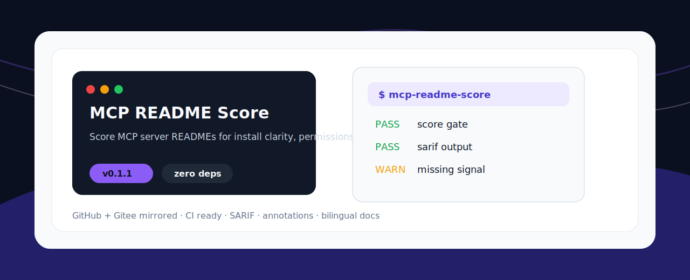
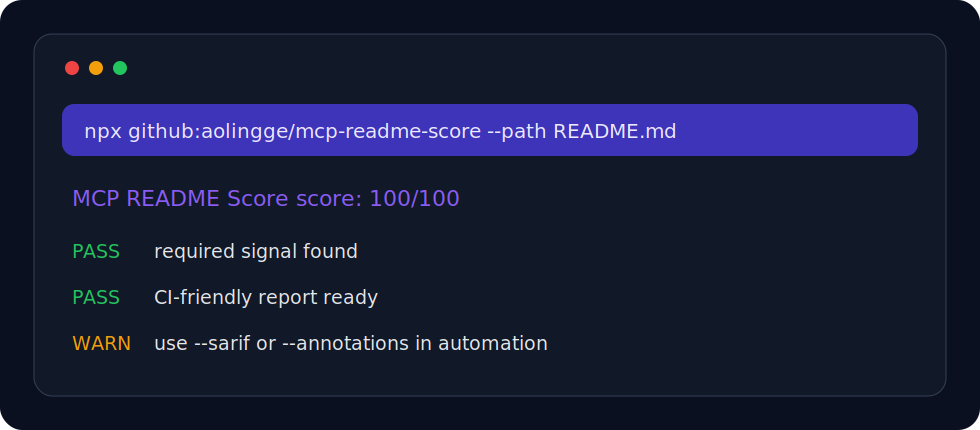

<p align="center">
  
</p>

<h1 align="center">MCP README Score</h1>

<p align="center">Score MCP server READMEs for install clarity, permissions, env vars, security notes, and examples.</p>

<p align="center"><a href="README.zh-CN.md">中文</a> · <a href="#quick-start">Quick Start</a> · <a href="#checks">Checks</a></p>

<p align="center">
  
  
  
</p>

<p align="center">
  
</p>

## Why This Exists

AI agent tooling is growing quickly, but many repos still miss tiny checks that can run locally or in CI. This project stays zero-dependency, short-command, and easy to fork.

## Quick Start

```bash
npx github:aolingge/mcp-readme-score --path README.md
```

Generate Markdown:

```bash
npx github:aolingge/mcp-readme-score --path README.md --markdown > report.md
```

Use a score gate:

```bash
npx github:aolingge/mcp-readme-score --path README.md --min-score 80
```

## Checks

| Check | What it looks for |
| --- | --- |
| install | Shows install instructions. |
| configuration | Shows client configuration. |
| permissions | Explains permissions. |
| security | Mentions security boundary. |

## Output

```text
MCP README Score score: 100/100
PASS  example-check  Useful signal found
FAIL  missing-check  Add the missing guidance
```


## Quality Gate

Use this project as a repeatable gate before an AI agent marks work as done:

- [Quality gate guide](docs/quality-gates.md)
- [Copy-ready GitHub Actions example](examples/github-action.yml)

## CI Usage

Use GitHub Actions annotations:

```bash
npx github:aolingge/mcp-readme-score --path fixtures/good.txt --annotations
```

Generate SARIF:

```bash
npx github:aolingge/mcp-readme-score --path fixtures/good.txt --sarif > results.sarif
```

See [docs/github-actions.md](docs/github-actions.md).

## Visual Identity

The banner and CLI preview are SVG assets committed in `assets/`, so the README renders cleanly on GitHub and Gitee without external image hosting.

## Mirrors

- GitHub: https://github.com/aolingge/mcp-readme-score
- Gitee: https://gitee.com/aolingge/mcp-readme-score

## Contributing

Good first PRs: add checks, add fixtures, improve docs, or add GitHub Actions examples.

## License

MIT
